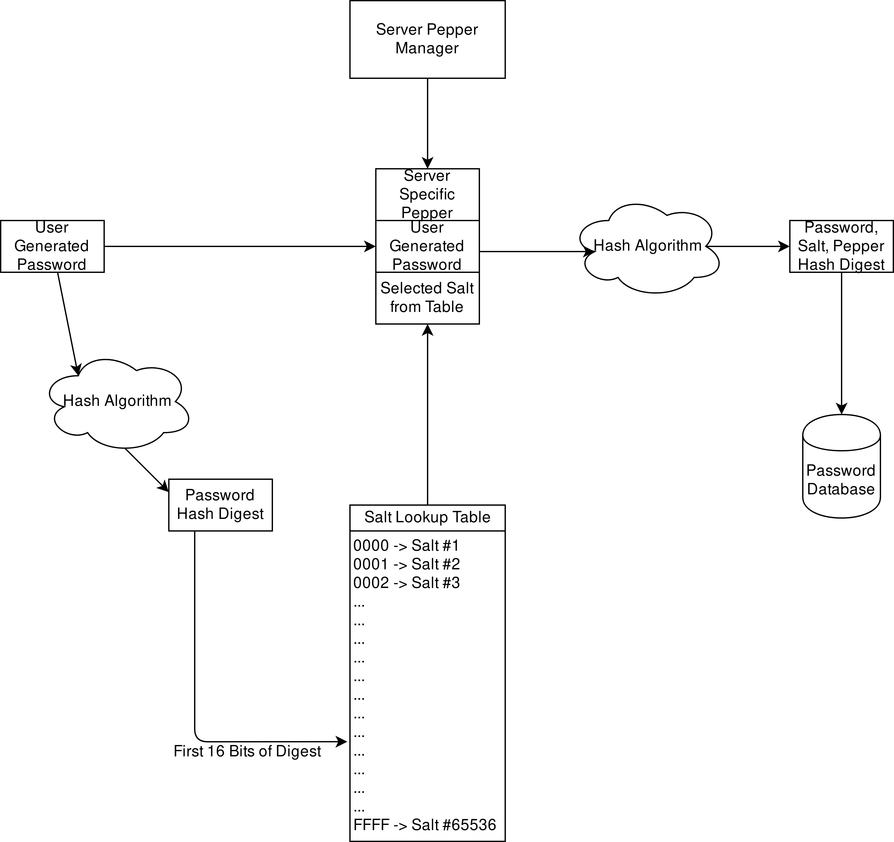

# Spice Cabinet
An implementation for password storage providing a pseudo-random salt and pepper selection process. The process involves the use of a hash algorithm to decide the salt used, along with a pre-determined secret pepper for increased obfuscation of user passwords on a server.
# Description
Servers commonly use both random salts and secret pepper when hashing user passwords in a database. A downside to this practice is the necessity of storing the secret salt with the associated hash value in the database of user passwords. I propose an improvement to this method, wherein the server will select a pre-defined salt from a table of possible salts using the hash digest of the user's input. The server will then concatenate the selected salt, the user's password, and a secret server pepper to serve as input for another hash function, the result of which will be kept within a server database.
# Benefits
By keeping the salts seperate from the database of hashed passwords, attackers who gain access to the database of hashed passwords will be unable to determine which salt is used for each password, without knowing hash value of the original plaintext password. The use of a random salt and secret pepper is commonly used when calculating hash values to be placed within a password database, to increase the length of the plaintext value being input into the hash function.
# Detriments
This method requires the server to perform two hash calculations every time a new password is added to the database, and two hash calculations every time a user attempts to validate existing credentials.
# Considerations
- This method has an assumption that the hash function has a random distribtution of possible values within the first n-bits. An unequal distribution of possible hash values could be used to identify salts that are "more likely" than others to be selected from the initial salt selection algorithm.
- I am considering adding the secret server "pepper" to the initial hash function to help mitigate the calculation of possible hash results from standard dictionary attacks. This would reduce the ability of a hacker to determine which salt was used by each entry in the database.

# Diagram

